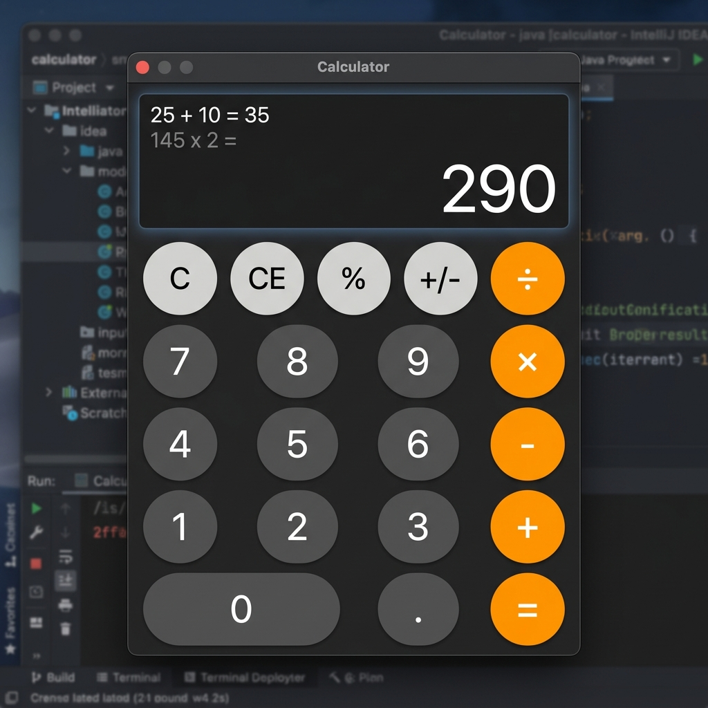

# 🧮 Modern Java Swing Calculator


A sleek, modern desktop calculator application built entirely with Java Swing. The graphical user interface has been customized to feature a responsive dark mode aesthetic with rounded buttons, providing a clean and intuitive user experience inspired by contemporary mobile applications.

---

## 📖 Problem Statement

Standard desktop applications built with native Java Swing components often look outdated and rigid, relying on classic rectangular borders and default cross-platform themes. The objective of this project is to demonstrate how native Java Swing can be easily customized through custom painting components—such as overriding button painting behaviors and leveraging advanced fonts and layouts—to create a beautiful, modern, and engaging user interface without relying on external UI framework dependencies.

## 🛠️ Tools Used

- **Programming Language**: Java (JDK 8 or higher)
- **GUI Framework**: Java Swing & AWT (`javax.swing.*`, `java.awt.*`)
- **Core Concepts**: Custom UI Painting (`paintComponent`), Action Listeners, GridBagLayout, Font Customization.

## 🚀 Installation Steps

1. **Clone the Repository**
   Download or clone the project source code to your local machine.

2. **Verify Java Installation**
   Ensure that a Java Development Kit (JDK) is installed on your system. You can verify this by running:
   ```bash
   java -version
   javac -version
   ```

3. **Navigate to the Source Directory**
   Open your terminal or command prompt and change your working directory to the `src` folder of the project.
   ```bash
   cd path/to/calculator-swing/src
   ```

## ⚙️ Execution Procedure

1. **Compile the Java Files**
   In the `src` directory, compile the custom UI component and the main application using the Java compiler.
   ```bash
   javac Main.java RoundedButton.java
   ```

2. **Run the Application**
   Once successfully compiled, run the `Main` class to launch the calculator application.
   ```bash
   java Main
   ```

## 📸 Output Screenshots

Below is a mockup preview of the modernized calculator Interface:



*(Note: Actual window chrome may vary depending on your host Operating System)*

## 💡 Conclusion

This project successfully proves that robust, beautiful, and highly responsive modern user interfaces can be built using standard Java UI toolkits. By employing custom object rendering and intuitive dark mode color palettes, we significantly improved the aesthetics of a classical basic calculator application while retaining complete control over layout and execution.
